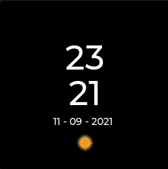
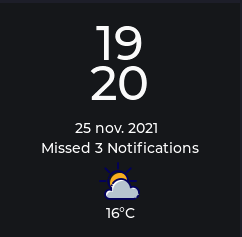

# Timely

### Under development

A [KairOS](https://github.com/Calebe94/KairOS.git) launcher.

This launcher is highly based on layout proposed by [Roy-Ermers](https://github.com/Roy-Ermers) on [My-TTGO-Watch](https://github.com/sharandac/My-TTGO-Watch) issue [#147](https://github.com/sharandac/My-TTGO-Watch/issues/147).

 

<h3>Lock Screen</h3>

In this screen you can check the date and time, and also see if you have unreaded notifications.

 

<h3>Lock Screen</h3>

In this screen you can also check the date and time, check the weather and see how many unreaded notifications(if you have).

 

## Dependencies

* [lvgl](https://github.com/lvgl/lvgl);

## Setup

Comming soon ...

## Usage

Comming soon ...

## Developer

<a href="https://github.com/Calebe94">Edimar Calebe Castanho(Calebe94)</a>

# License

All software is covered under [GNU General Public License v3.0](https://www.gnu.org/licenses/gpl-3.0.en.html).
